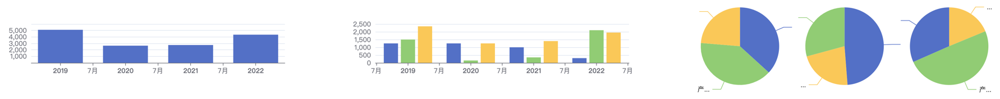

### 销售场景

背景：销售公司有 三个 销售小组，公司有三种销售产品。根据多个维度进行统计

```javascript
// 销售小组
[{ name: '员工A', group: '华南区' }, { name: '员工B', group: '华北区' }, { name: '员工C', group: '华中区' }]
// 销售产品
  [{ name: '产品甲', price: 100 }, { name: '产品乙', price: 150 }, { name: '产品丙', price: 200 }]
```

销售数据

```ts
// 销售订单
interface SaleItem {
  id: string //订单id
  userName: string, // 销售员
  userGroup: string,// 销售员所在小组
  productName: string, // 销售的商品
  time: string  // 销售时间
  price: number // 商品售价
}
```

销售的原始数据由 `SaleItem[]` 组件,所有场景的效果如图



1. 统计公司每年的销售额走势

要统计销售额走势，需计算出每年的销售额即可。后台提供的数据如下

```ts
interface SaleAmonutByYear{
  year:string
  amount:number
}

// 数据样例
[
  {
    "year": "2021",
    "amount": 4350
  },
  {
    "year": "2020",
    "amount": 3650
  },
  {
    "year": "2019",
    "amount": 2200
  },
  {
    "year": "2022",
    "amount": 4700
  }
]
```

最终使用echarts 的配置为

```json
{
    "xAxis": {
        "type": "time"
    },
    "yAxis": {},
    "dataset": {
        "source": [
            {
                "year": "2020",
                "amount": 2650
            },
            {
                "year": "2019",
                "amount": 5100
            },
            {
                "year": "2022",
                "amount": 4350
            },
            {
                "year": "2021",
                "amount": 2750
            }
        ]
    },
    "series": [
        {
            "type": "bar",
            "encode": {
                "x": "year",
                "y": "amount"
            }
        }
    ]
}
```


2. 所有年度每个销售组的销售额对比，后台的数据格式为

```ts
interface AmountByGroupPerYear{
  year: string  // 销售年份
  name: string  // 小组名
  amount: number // 小组的销售额
}

```

后台给的数据格式不能直接配出所需要的echarts配置，需要对数据做聚合，聚合成

```ts
interface AmountByGroupPerYear{
  year:string
  [groupName]:string  // 有多少个销售小组，就有多少个key
  amount:string
}
```

聚合之后的数据样例
```json
[
  {
    "year": "2021",
    "华中区": 850,
    "华南区": 2000,
    "华北区": 850
  },
  {
    "year": "2022",
    "华北区": 1700,
    "华南区": 1250,
    "华中区": 950
  },
  {
    "year": "2019",
    "华北区": 800,
    "华中区": 2150,
    "华南区": 550
  },
  {
    "year": "2020",
    "华南区": 1650,
    "华中区": 1850,
    "华北区": 600
  }
]
```

最终图标的echarts配置为

```json
{
    "xAxis": {
        "type": "time"
    },
    "yAxis": {},
    "dataset": {
        "source": [
            {
                "year": "2020",
                "华中区": 1250,
                "华南区": 1250,
                "华北区": 150
            },
            {
                "year": "2019",
                "华南区": 1250,
                "华中区": 2350,
                "华北区": 1500
            },
            {
                "year": "2022",
                "华中区": 1950,
                "华北区": 2100,
                "华南区": 300
            },
            {
                "year": "2021",
                "华中区": 1400,
                "华南区": 1000,
                "华北区": 350
            }
        ]
    },
    "series": [
        {
            "type": "bar",
            "encode": {
                "x": "year",
                "y": "华南区"
            }
        },
        {
            "type": "bar",
            "encode": {
                "x": "year",
                "y": "华北区"
            }
        },
        {
            "type": "bar",
            "encode": {
                "x": "year",
                "y": "华中区"
            }
        }
    ]
}
```

3. 某一年每个小组每个产品的销售占比，要求分多个饼图展示（其实是一个图形）

`echart 有grid属性用来做直角坐标系的网格，但是饼图不适用，饼图有自己的left,top等属性来做`

后台给的数据格式为
```ts
interface AmountDetailPerGroup{
  productName:string
  groupName:string  // 
  amount:string
}
```


最后实现的echarts配置为

```json
{
    "grid": [
        {
            "left": "0%",
            "top": 0,
            "width": "33%",
            "height": "100%"
        },
        {
            "left": "33%",
            "top": 0,
            "width": "33%",
            "height": "100%"
        },
        {
            "left": "66%",
            "top": 0,
            "width": "33%",
            "height": "100%"
        }
    ],
    "xAxis": [
        {
            "gridIndex": 0,
            "type": "category"
        },
        {
            "gridIndex": 1,
            "type": "category"
        },
        {
            "gridIndex": 2,
            "type": "category"
        }
    ],
    "yAxis": [
        {
            "gridIndex": 0
        },
        {
            "gridIndex": 1
        },
        {
            "gridIndex": 2
        }
    ],
    "dataset": [
        {
            "source": [
                {
                    "label": "产品甲",
                    "value": 1100
                },
                {
                    "label": "产品丙",
                    "value": 3000
                },
                {
                    "label": "产品乙",
                    "value": 1350
                }
            ]
        },
        {
            "source": [
                {
                    "label": "产品甲",
                    "value": 800
                },
                {
                    "label": "产品乙",
                    "value": 1950
                },
                {
                    "label": "产品丙",
                    "value": 1200
                }
            ]
        },
        {
            "source": [
                {
                    "label": "产品甲",
                    "value": 1300
                },
                {
                    "label": "产品丙",
                    "value": 3000
                },
                {
                    "label": "产品乙",
                    "value": 1500
                }
            ]
        }
    ],
    "series": [
        {
            "name": "华南区",
            "datasetIndex": 0,
            "left": "0%",
            "top": 0,
            "width": "33%",
            "height": "100%",
            "type": "pie"
        },
        {
            "name": "华北区",
            "datasetIndex": 1,
            "left": "33%",
            "top": 0,
            "width": "33%",
            "height": "100%",
            "type": "pie"
        },
        {
            "name": "华中区",
            "datasetIndex": 2,
            "left": "66%",
            "top": 0,
            "width": "33%",
            "height": "100%",
            "type": "pie"
        }
    ]
}
```

